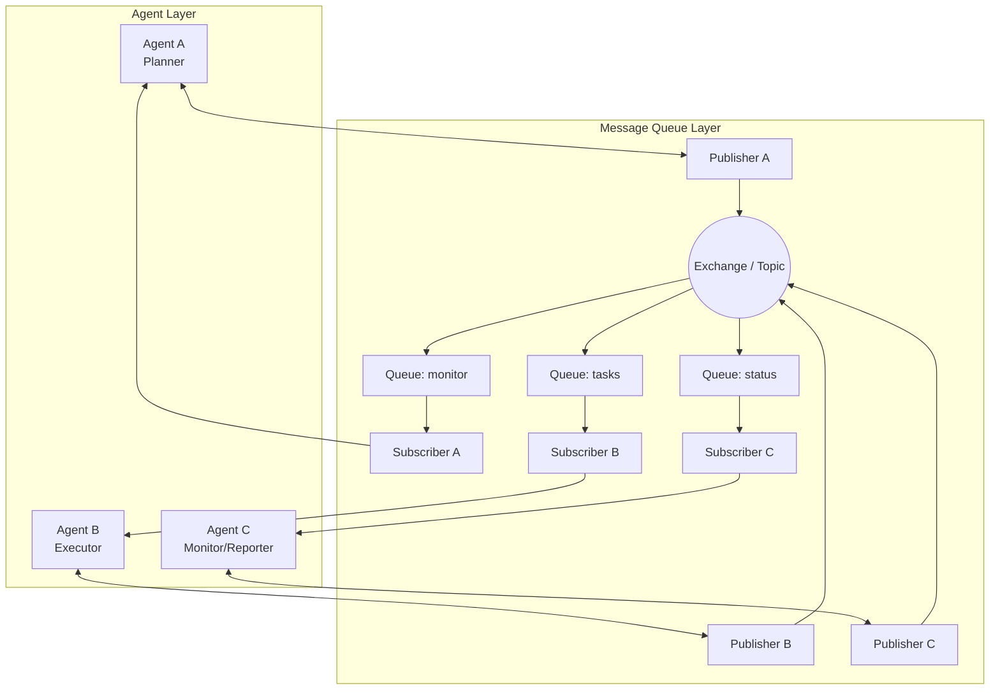
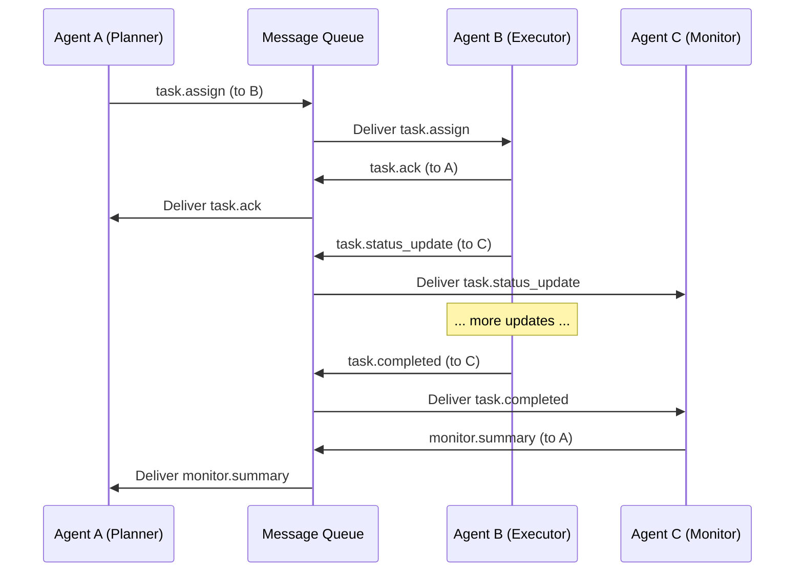

# Multi-Agent Communication Design Using Message Queue

> **AI Assistance Declaration:** This document was developed with assistance from an AI coding assistant (opencode / big-pickle model) to structure the architecture, refine the JSON schema, and format the Mermaid diagram.

---

## 1. Architecture Diagram



**Legend:**

| Component        | Description                                         |
| ---------------- | --------------------------------------------------- |
| **Agent A**      | Plans and decomposes tasks, publishes work orders.  |
| **Agent B**      | Executes sub-tasks, publishes status updates.       |
| **Agent C**      | Monitors progress, receives completion reports.     |
| **Exchange**     | Routing hub (topic exchange) that directs messages. |
| **Queue: tasks** | Holds task assignments; consumed by Agent B.        |
| **Queue: status**| Holds execution status; consumed by Agent C.        |
| **Queue: monitor**| Holds monitoring data; consumed by Agent A.        |

---

## 2. JSON Message Format

Every message exchanged between agents follows a uniform schema:

```json
{
  "schema_version": "1.0",
  "message_id": "msg-20260623-001",
  "correlation_id": "corr-abc123",
  "sender_id": "agent_a",
  "receiver_id": "agent_b",
  "message_type": "task.assign",
  "timestamp": "2026-06-23T10:30:00Z",
  "ttl_seconds": 300,
  "priority": "high",
  "payload": { }
}
```

### Field Definitions

| Field              | Type   | Required | Description                                                  |
| ------------------ | ------ | -------- | ------------------------------------------------------------ |
| `schema_version`   | string | Yes      | Version of the message schema for backward compatibility.    |
| `message_id`       | string | Yes      | Globally unique identifier for the message (UUID).           |
| `correlation_id`   | string | Yes      | Links related messages across a workflow (request/response). |
| `sender_id`        | string | Yes      | Identifier of the originating agent.                         |
| `receiver_id`      | string | Yes      | Target agent or `"*"` for broadcast.                         |
| `message_type`     | string | Yes      | Dot-notation type (see table below).                         |
| `timestamp`        | string | Yes      | ISO 8601 UTC timestamp of message creation.                  |
| `ttl_seconds`      | number | No       | Time-to-live; if not consumed within this window, discard.   |
| `priority`         | enum   | No       | `"low"`, `"medium"` (default), or `"high"`.                  |
| `payload`          | object | Yes      | Type-specific data (see examples below).                     |

### Message Types

| `message_type`             | Direction         | Purpose                                      |
| -------------------------- | ----------------- | -------------------------------------------- |
| `task.assign`              | A → B             | Assign a new sub-task to Agent B.            |
| `task.ack`                 | B → A             | Acknowledge receipt of a task assignment.    |
| `task.status_update`       | B → C             | Report incremental progress/status.          |
| `task.completed`           | B → C             | Report task completion with results.         |
| `task.failed`              | B → C             | Report task failure with error details.      |
| `monitor.heartbeat`        | C → A             | Periodic health / progress heartbeat.        |
| `monitor.summary`          | C → A             | Final summary report for the entire workflow.|
| `error.delivery_failure`   | System → *        | Generated by queue infrastructure on timeout.|

---

## 3. Communication Flow — Concrete Scenario

### Scenario Overview

1. **Agent A** plans a task "Process Patient Record #4421" and publishes it.
2. **Agent B** receives the task, processes it, and reports progress to **Agent C**.
3. **Agent B** finishes and sends a completion report to **Agent C**.
4. **Agent C** collates all reports and publishes a final summary.

### Step-by-Step Messages

#### Step 1: Agent A assigns the task

**Published to** → Exchange → `tasks` queue (consumed by Agent B)

```json
{
  "schema_version": "1.0",
  "message_id": "msg-20260623-001",
  "correlation_id": "wf-patient-4421",
  "sender_id": "agent_a",
  "receiver_id": "agent_b",
  "message_type": "task.assign",
  "timestamp": "2026-06-23T10:30:00Z",
  "ttl_seconds": 600,
  "priority": "high",
  "payload": {
    "task_id": "task-001",
    "task_type": "process_medical_record",
    "parameters": {
      "patient_id": "4421",
      "record_path": "s3://records/4421.pdf",
      "actions": ["extract_fields", "validate_codes", "flag_anomalies"]
    },
    "deadline": "2026-06-23T11:00:00Z"
  }
}
```

#### Step 2: Agent B acknowledges receipt (optional reliability step)

**Published to** → Exchange → `monitor` queue (consumed by Agent A)

```json
{
  "schema_version": "1.0",
  "message_id": "msg-20260623-002",
  "correlation_id": "wf-patient-4421",
  "sender_id": "agent_b",
  "receiver_id": "agent_a",
  "message_type": "task.ack",
  "timestamp": "2026-06-23T10:30:01Z",
  "ttl_seconds": 60,
  "priority": "low",
  "payload": {
    "task_id": "task-001",
    "status": "received",
    "estimated_completion": "2026-06-23T10:45:00Z"
  }
}
```

#### Step 3: Agent B sends periodic status updates to Agent C

**Published to** → Exchange → `status` queue (consumed by Agent C)

```json
{
  "schema_version": "1.0",
  "message_id": "msg-20260623-003",
  "correlation_id": "wf-patient-4421",
  "sender_id": "agent_b",
  "receiver_id": "agent_c",
  "message_type": "task.status_update",
  "timestamp": "2026-06-23T10:35:00Z",
  "ttl_seconds": 120,
  "priority": "medium",
  "payload": {
    "task_id": "task-001",
    "progress_pct": 45,
    "current_step": "validate_codes",
    "logs": ["Extracted 12 fields", "Validating ICD-10 codes..."],
    "errors_warnings": []
  }
}
```

#### Step 4: Agent B reports completion to Agent C

**Published to** → Exchange → `status` queue (consumed by Agent C)

```json
{
  "schema_version": "1.0",
  "message_id": "msg-20260623-004",
  "correlation_id": "wf-patient-4421",
  "sender_id": "agent_b",
  "receiver_id": "agent_c",
  "message_type": "task.completed",
  "timestamp": "2026-06-23T10:42:00Z",
  "ttl_seconds": 300,
  "priority": "high",
  "payload": {
    "task_id": "task-001",
    "result_summary": {
      "fields_extracted": 14,
      "codes_validated": 8,
      "anomalies_flaged": 1,
      "anomaly_details": ["Unexpected lab value: Glucose=450 mg/dL"]
    },
    "artifacts": ["s3://results/4421-summary.json"],
    "execution_time_ms": 720000
  }
}
```

#### Step 5: Agent C publishes a final summary (monitoring/reporting)

**Published to** → Exchange → `monitor` queue (consumed by Agent A)

```json
{
  "schema_version": "1.0",
  "message_id": "msg-20260623-005",
  "correlation_id": "wf-patient-4421",
  "sender_id": "agent_c",
  "receiver_id": "agent_a",
  "message_type": "monitor.summary",
  "timestamp": "2026-06-23T10:42:05Z",
  "ttl_seconds": 3600,
  "priority": "high",
  "payload": {
    "workflow_id": "wf-patient-4421",
    "overall_status": "completed_with_warnings",
    "tasks": [
      {
        "task_id": "task-001",
        "assigned_to": "agent_b",
        "status": "completed",
        "duration_ms": 720000,
        "warnings": 1
      }
    ],
    "total_duration_ms": 720500,
    "report_url": "s3://reports/wf-patient-4421.md"
  }
}
```

### Sequence Diagram



---

## 4. Error Handling

### 4.1 Message Delivery Failures

| Failure Scenario          | Mitigation Strategy                                         |
| ------------------------- | ----------------------------------------------------------- |
| **Queue unavailable**     | Publishers use a local buffer with retry + exponential backoff. After N retries, fall back to a dead-letter queue (DLQ). |
| **Message not consumed**  | Each message carries a `ttl_seconds`. If TTL expires, the queue moves it to a DLQ for manual inspection. |
| **Corrupt message**       | Consumers validate JSON schema before processing. Invalid messages are rejected and routed to a DLQ with reason codes. |
| **Network partition**     | Agents use connection heartbeat + reconnection logic. Queues are configured for persistence (survive broker restarts). |

### 4.2 Agents Going Offline

| Scenario                  | Handling                                                     |
| ------------------------- | ------------------------------------------------------------ |
| **Agent B goes down**     | Queue persists messages. When B restarts, it processes backlog. A monitoring timeout (e.g., no `task.ack` within 30 s) triggers A to reassign the task to a standby executor. |
| **Agent C goes down**     | Status messages accumulate in the `status` queue. On restart, C replays them and produces a consistent summary. |
| **Agent A goes down**     | `monitor.summary` waits in queue. C periodically re-publishes if no acknowledgment from A. |
| **All agents down**       | Messages remain durably stored in the queue. On recovery, the system resumes from the last checkpoint using `correlation_id` deduplication. |
| **Duplicate messages**    | Consumers use `correlation_id` + idempotent processing to safely handle at-least-once delivery semantics. |

### 4.3 Queue-Level Reliability

- **Persistence:** All queues are configured with durable storage (messages survive broker restarts).
- **Acknowledgments:** Consumer auto-ack is disabled. Agents explicitly `ack` only after successful processing.
- **Dead-Letter Queue (DLQ):** Any message that cannot be delivered or fails processing after N retries is moved to a DLQ for forensic analysis.
- **Monitoring Alerts:** If DLQ depth exceeds a threshold, an alert is fired to the operations team.

---

## 5. Appendix: Technology Recommendation

| Component      | Recommended Technology | Rationale                                      |
| -------------- | --------------------- | ---------------------------------------------- |
| Message Broker | RabbitMQ              | Lightweight, mature, supports topic exchanges. |
| Agent SDK      | Pika (Python) / amqplib (Node.js) | Well-maintained AMQP libraries.     |
| Schema Validation | JSON Schema (Ajv / jsonschema) | Validate messages at producer and consumer edges. |
| DLQ / Retry    | RabbitMQ DLX + retry plugin | Built-in dead-letter exchange support. |

---